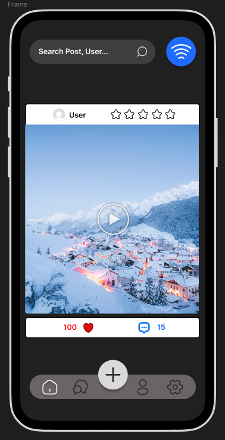
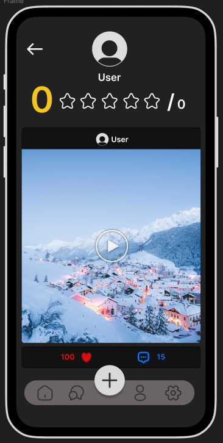
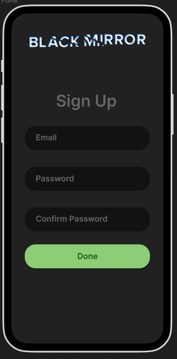
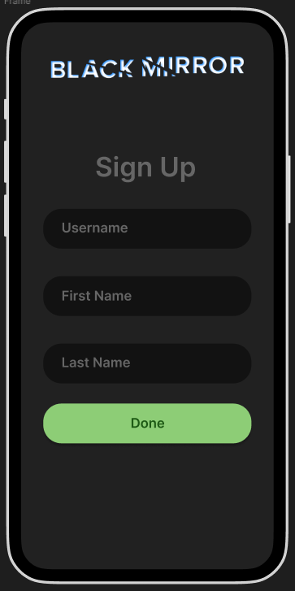
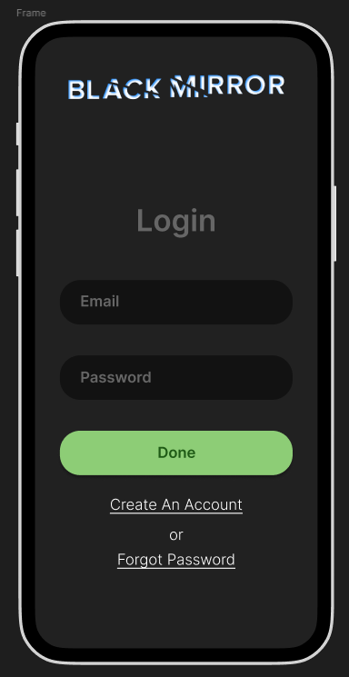

# DystOpia - Social Media App

<h1>Video Demo</h1>

<h1>What Is DystOpia?</h1>

It's an experimental social media app (proof of concept) that has a star rating system at the crux of it and doesn't use followers. This app was Inspired by Black Mirror, Episode: Nosedive.

<h1>Initial Figma Concept Designs</h1>

  
  
  

  
  

<h1>Current Features</h1>
<ul>
  <li>Add Posts</li>
  <li>Add Images From Gallery</li>
  <li>Add Photos From Camera</li>
  <li>Rate Users With Star System</li>
  <li>See Users' Average Star Rating & No. Of Ratings</li>
  <li>Like Posts</li>
</ul>

<h1>Future Features</h1>
<ul>
  <li>Find Nearby Users via Bluetooth (like airdrop) and Rate Them</li>
  <li>Search For Users and Posts</li>
  <li>Comment On Posts</li>
  <li>Add Friends</li>
</ul>
